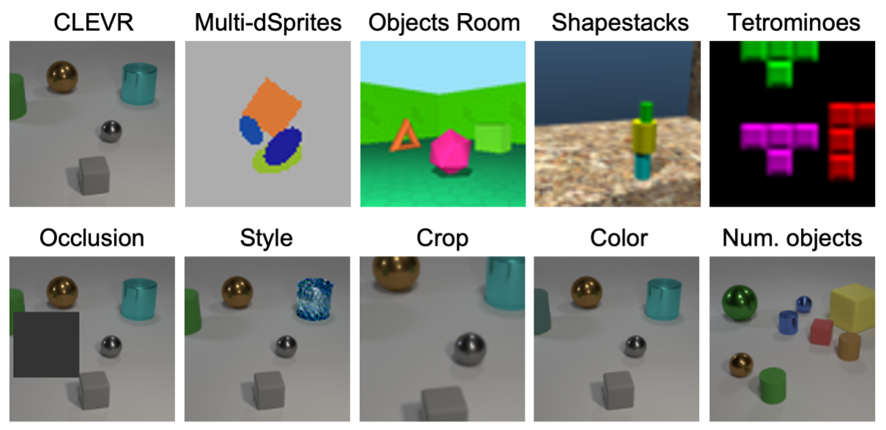
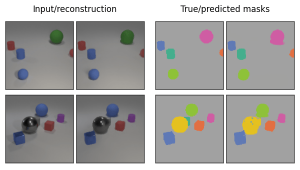
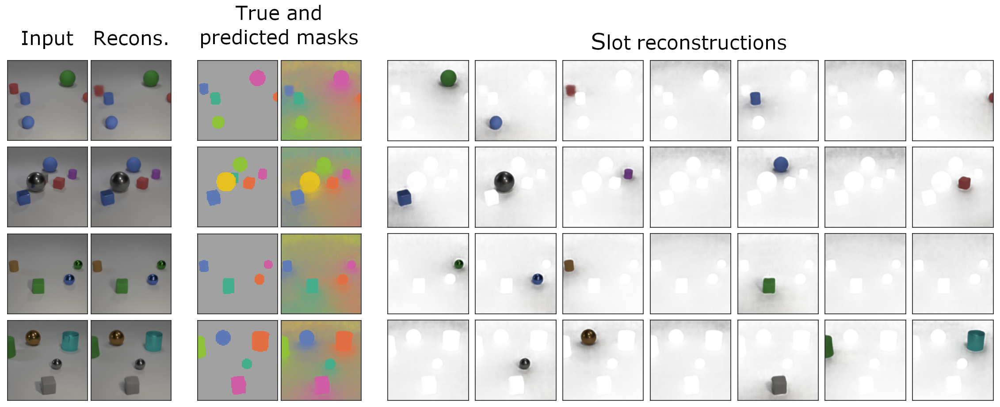
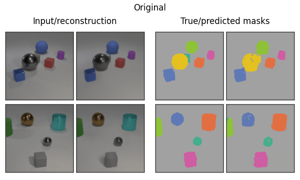

Projecy forked from addtt
# Object-centric library

Code accompanying our paper:

> [Generalization and Robustness Implications in Object-Centric Learning](https://arxiv.org/abs/2107.00637) <br/>
> Andrea Dittadi, Samuele Papa, Michele De Vita, Bernhard Schölkopf, Ole Winther, Francesco Locatello <br/>
> ICML 2022

Summary of out-of-the-box functionalities (see [Using the library](#using-the-library)):
- **training** object-centric models (plus a VAE baseline) on multi-object datasets;
- **evaluating** trained models in terms of: 
  - object segmentation;
  - a downstream task consisting in predicting all object properties;
  - qualitative performance, e.g., showing reconstructions, segmentation masks, and 
      separate reconstructions from each slot.
- evaluating the **generalization** of trained models 
  (again in terms of object segmentation and downstream task performance, 
  as well as in a qualitative way) under a range of distribution shifts.

The image below showcases the datasets (top row) and the distribution shifts
available in CLEVR (bottom row). 

<p align="center">

</p>

Visualizations of a few object-centric models on the five datasets in the library:

<p align="center">

</p>


Example full visualization of a single trained model, including separate slot reconstructions:

<p align="center">

</p>

Visualizations of a few object-centric models on the distribution shifts on CLEVR:

<p align="center">

</p>


The library can be [extended](#extending-the-library) with more models, datasets, distribution shifts, evaluation metrics, and downstream tasks.


## Setting up the environment

1. Install requirements from [`requirements.txt`](requirements.txt). 
Example installation with [conda](https://docs.conda.io/projects/conda/en/latest/user-guide/install/index.html):

    ```shell
    conda create --name object_centric_lib python=3.8
    conda activate object_centric_lib
    
    # Optionally install PyTorch with a custom CUDA version. Example:
    # pip install torch torchvision --extra-index-url https://download.pytorch.org/whl/cu113
    
    pip install -r requirements.txt
    ```
    
    Note: PyTorch might have to be installed separately _before_ installing the requirements,
    depending on the required CUDA version
    (see the [PyTorch installation instructions](https://pytorch.org/get-started/locally/)).

    Python 3.8 recommended (&ge;3.8 required). 

3. Set the environment variable `OBJECT_CENTRIC_LIB_DATA` to the folder where the datasets should be stored. 

4. Download the datasets with [`download_data.py`](download_data.py).

    <details>
   
    <summary>Click here for examples</summary>
    
    ```shell
    # Download all datasets
    python download_data.py -d all
    
    # Download all datasets, including style transfer versions
    python download_data.py -d all --include-style
    
    # Download only some datasets, without style transfer
    python download_data.py -d multidsprites clevr
    ```

    </details>   

    Each dataset is a `.hdf5` file and its metadata is in a corresponding
    `${DATASET_NAME}_metadata.npy` file. 
    Custom datasets may override these defaults.


4. Check the integrity of the dataset files by running `python check_data.py`.


## Using the library

### Quick start


1. Train a model with default parameters:

    ```shell
    python train_object_discovery.py model=monet dataset=multidsprites
    ```
    
    This saves the model and the logs by default in `outputs/runs/${MODEL}-${DATASET}-${DATETIME}`.

2. Evaluate reconstruction and segmentation metrics, given the path to the
root folder of the experimental run:

    ```shell
    python eval_metrics.py checkpoint_path=outputs/runs/monet-multidsprites-YYYY-MM-DD_HH-MM-SS
    ```

3. Run the downstream object property prediction task (training + evaluation):

    ```shell
    python eval_downstream_prediction.py downstream_model=linear checkpoint_path=outputs/runs/monet-multidsprites-YYYY-MM-DD_HH-MM-SS
    ```

4. Save visualizations (reconstructions, masks, slot reconstructions):

    ```shell
    python eval_qualitative.py checkpoint_path=outputs/runs/monet-multidsprites-YYYY-MM-DD_HH-MM-SS
    ```
   
All evaluation results are saved in `${RUN_ROOT}/evaluation`, e.g., `outputs/runs/monet-multidsprites-YYYY-MM-DD_HH-MM-SS/evaluation`.


Currently, the library includes the following models:
- [GENESIS](https://arxiv.org/abs/1907.13052) - `genesis`
- [MONet](https://arxiv.org/abs/1901.11390) - `monet`
- [Slot Attention](https://arxiv.org/abs/2006.15055) - `slot-attention`
- [SPACE](https://arxiv.org/abs/2001.02407) - `space`
- Standard VAE - `baseline_vae_mlp`
- VAE with [broadcast decoder](https://arxiv.org/abs/1901.07017) - `baseline_vae_broadcast`

and the following datasets:
- [CLEVR](https://cs.stanford.edu/people/jcjohns/clevr/) - `clevr` (the original dataset has 10 objects: to train on CLEVR6, add `+dataset.variant=6` to the command line)
- [Multi-dSprites](https://github.com/deepmind/multi_object_datasets) - `multidsprites`
- [Objects Room](https://github.com/deepmind/multi_object_datasets) - `objects_room`
- [Shapestacks](https://ogroth.github.io/shapestacks/) - `shapestacks`
- [Tetrominoes](https://github.com/deepmind/multi_object_datasets) - `tetrominoes`


Read the following sections for further details.


### Training a model

```shell
python train_object_discovery.py model=${MODEL} dataset=${DATASET}
```

This command trains the specified model on the specified dataset, with default 
parameters defined by the [hydra](https://hydra.cc/) configuration files in [`config/`](config/).
The base config file for this script is [`config/train_object_discovery.yaml`](config/train_object_discovery.yaml).

The run folder is handled by hydra, and by default it is `outputs/runs/${MODEL}-${DATASET}-${DATETIME}`.
This can be customized using hydra by adding, e.g., `hydra.run.dir=outputs/runs/${model.name}-${dataset.name}`
to the command line.

The model and dataset correspond to config files -- e.g., `model=slot-attention` reads the model
config from [`config/model/slot-attention.yaml`](config/model/slot-attention.yaml) and `dataset=multidsprites` reads the
dataset config from [`config/dataset/multidsprites.yaml`](config/dataset/multidsprites.yaml).
In some cases we define custom parameters for specific combinations of dataset and model: these are
defined in the folder [`config/special_cases`](config/special_cases).

Dataset variants can define dataset filters or transforms to test robustness to distribution shifts.
A variant is picked by adding `+dataset.variant=${VARIANT}` to the command line: e.g. 
CLEVR6 is `dataset=clevr +dataset.variant=6`, and Tetrominoes with occlusions is
`dataset=tetrominoes +dataset.variant=occlusion`.
For more information on dataset variants, see [`config/dataset/variants/readme.md`](config/dataset/variants/readme.md).

All models are configured through hydra, including the training setup. The default parameters 
are defined in the model's YAML file, and these can be overridden from the command line.
E.g., we can change the foreground sigma, the MLP hidden size, and the learning rate schedule of MONet as follows:
```shell
python train_object_discovery.py model=monet dataset=shapestacks model.fg_sigma=0.15 model.encoder_params.mlp_hidden_size=128 trainer.exp_decay_rate=0.8
```

<details>

<summary>
Click to expand details on available flags
</summary>

There are some common flags that can be used with every model and dataset:
- `batch_size` (default given by the model config).
- `trainer.steps`: number of training steps (default given by the model config).
- `data_sizes`: size of the train, validation, and test sets (defaults given by the dataset config).
- `trainer.optimizer_config`: by default, the class, learning rate, and other parameters can be provided here
  (see e.g. [`config/model/monet.yaml`](config/model/monet.yaml)). We can also implement a custom `_make_optimizers()` method
  that handles more complex settings, e.g., where we need multiple optimizers: see for example
  [`config/model/space.yaml`](config/model/space.yaml) and [`models/space/trainer.py`](models/space/trainer.py).
- `trainer.clip_grad_norm`: float value for gradient norm clipping, or `None` for no clipping.
- frequency of checkpointing, validation, and logging: 
  `trainer.logweights_steps`, `trainer.logimages_steps`, `trainer.logloss_steps`, 
  `trainer.checkpoint_steps`, `trainer.logvalid_steps`.
- `allow_resume`: if the directory of the run exists, this flag controls whether the script
loads an existing checkpoint and resumes training, or it throws an exception.
- `num_workers`: for PyTorch data loaders.
- `dataset.skip_loading`: dummy data is loaded instead of the specified dataset (for debugging).
- `seed`: random seed.
- `debug`: if true, it launches a minimal run.
- `device`: cpu or cuda (default: cuda).

</details>


### Evaluation: metrics

```shell
python eval_metrics.py checkpoint_path=/path/to/run/folder
```

This command evaluates the reconstruction error (MSE) and 3 segmentation metrics (ARI, SC, mSC).
Typically no customization is necessary, but see [`config/eval_metrics.yaml`](config/eval_metrics.yaml).


<details>

<summary>
Click to expand details on available flags
</summary>

The `variant_types` flag allows to evaluate the metrics on different variants of the original 
training dataset: this is used by default to evaluate generalization 
(see the list of default variants in [`config/eval_metrics.yaml`](config/eval_metrics.yaml)).
The `overwrite` flag allows overwriting the result folder for this evaluation, 
and is `False` by default.

The `seed`, `debug`, and `device` flags are also available here, with the same 
behavior as in `train_object_discovery.py`.

</details>


### Evaluation: downstream task 

```shell
python eval_downstream_prediction.py checkpoint_path=/path/to/run/folder downstream_model=linear
```

This command trains and evaluates a downstream linear model to predict (from the representations
of the upstream model) the properties of the objects in a scene.
This is configured by [`config/eval_downstream_prediction.yaml`](config/eval_downstream_prediction.yaml). 
See the comments on the file for more information. 
Note that a results subfolder is created specifically for each combination of
matching, downstream model, and dataset variant.

<details>

<summary>
Click to expand details on available flags
</summary>

Typically useful flags (see the config file for more):
- `downstream_model`: the type of downstream model, such as `linear` or `MLP3`.
- `matching`: method for matching objects with model slots.
- `variant_types`: for each of the specified variant types, train a downstream model
and then test it on all variant types (including the one it was trained on).
- `steps`
- `batch_size`
- `learning_rate`
- `train_size`
- `validation_size`
- `test_size`

The `seed`, `debug`, `overwrite`, and `device` flags are also available here,
with the same behavior as in `eval_metrics.py`.

</details>


### Evaluation: save visualizations

```shell
python eval_qualitative.py checkpoint_path=/path/to/run/folder
```

This command saves model visualizations, and typically does not require customization.
The `seed`, `debug`, `overwrite`, and `device` flags are also available here.


### Sweeps

To run many experiments in a structured sweep over parameters and/or settings,
the library has a "sweep" functionality.

For example, to train all object-centric models in the study in 
[our paper](https://arxiv.org/abs/2107.00637),
we defined a sweep in [`sweeps/configs/sweep_object_centric.py`](sweeps/configs/sweep_object_centric.py).
This creates a sweep called `"object_centric"`, which maps a model number to a specific
configuration of command line arguments.

The first model in the sweep is trained as follows:
```shell
python sweep_train.py --sweep-name object_centric --model-num 0
```
Since in this case we have 10 seeds, 4 models, and 5 datasets, any model number
up to 199 would be valid.

This script internally calls [`train_object_discovery.py`](train_object_discovery.py)
with the appropriate arguments as prescribed by the sweep, 
and uses `outputs/sweeps/sweep_${SWEEP_NAME}/${MODEL_NUMBER}/` as output folder.

Use `python -m sweeps.sweep_progress SWEEP_NAME` to get an overview of the overall progress of the sweep.


## Extending the library

The library easily allows adding models, datasets, dataset variants, evaluation metrics, and downstream tasks. Feel free to reach out for questions at:

> andrea 
[&#273;&ouml;t] 
dittadi 
[&aring;t] 
gmail 
[&#273;&ouml;t] 
com


## Contributors

- [Andrea Dittadi](https://github.com/addtt)
- [Samuele Papa](https://github.com/apra)
- [Michele De Vita](https://github.com/Michedev)


## Citation

If you use this code in your own work, please cite
[our paper](https://arxiv.org/abs/2107.00637) as follows:

```
@inproceedings{dittadi2022generalization,
  title={Generalization and Robustness Implications in Object-Centric Learning},
  author={Dittadi, Andrea and Papa, Samuele and De Vita, Michele and Sch{\"o}lkopf, Bernhard and Winther, Ole and Locatello, Francesco},
  booktitle={International Conference on Machine Learning},
  year={2022},
}
```
